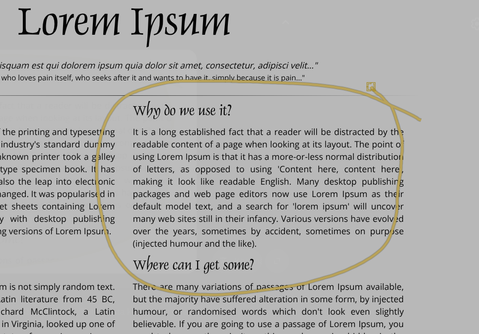
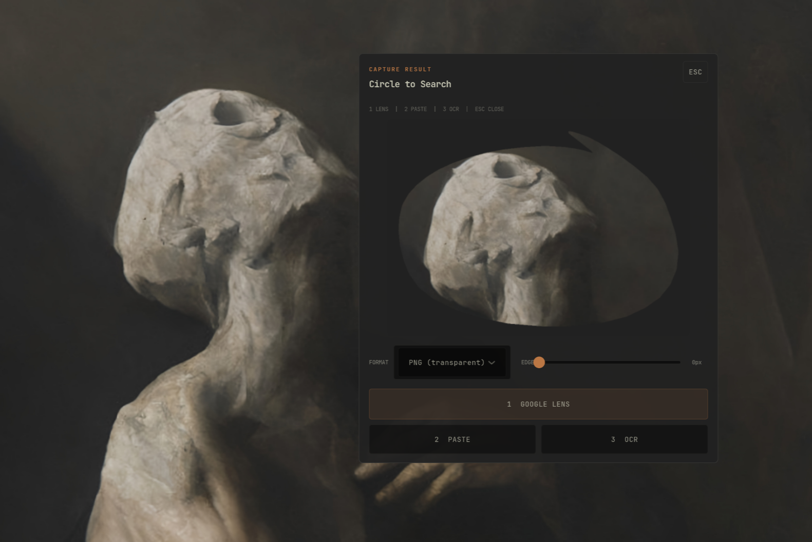
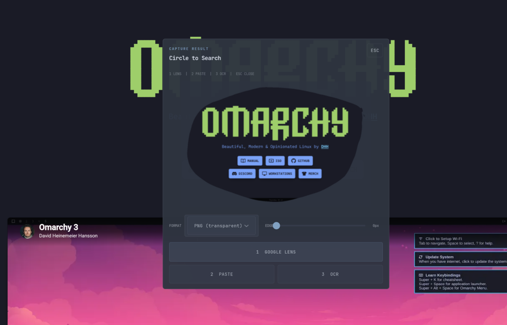

## Circle to Search for Omarchy with native theming

|| Supports multi-monitor setups, including mixed-DPI and fractional scaling. ||

Draw a freehand region on your screen, then:

- search it with Google Lens
- extract text with OCR
- translate text with Google Translate or an optional local Ollama model

How it works:

1. A transparent GTK layer-shell overlay opens on the live desktop.
2. You draw around the thing you want.
3. The region is captured with `grim` at native resolution.
4. The result goes to Google Lens, OCR, Google Translate, or optional local translation.

Uses:

- Python
- GTK 3 / PyGObject
- GTK Layer Shell
- Pillow
- grim
- Tesseract OCR
- Ollama (optional)

## Screenshots

<p>
  
  
</p>

<details>
<summary>More screenshots</summary>

<p>
  
  
</p>

<p>
  
  
</p>

</details>

## Install

### AUR (recommended)

```bash
yay -S omarchy-circle-to-search
```

Or with any AUR helper. After install, add the keybind to your Hyprland config:

```text
bind = SUPER ALT, C, exec, circle-to-search
```

Optional translate keybind (requires [Ollama](#ollama)):

```text
bind = SUPER ALT, T, exec, circle-to-search --translate
```

### Manual install

```bash
./install.sh
```

With Ollama support:

```bash
./install.sh --with-ollama
```

What install.sh does:

- installs required packages
- writes a managed keybind block into `~/.config/hypr/bindings.conf`
- reloads Hyprland
- writes an install manifest for `uninstall.sh`

Default keybind:

```text
Super + Alt + C
```

## Uninstall

AUR:

```bash
sudo pacman -R omarchy-circle-to-search
```

Manual — remove Circle to Search but keep shared host packages:

```bash
./uninstall.sh
```

Also remove packages installed by `install.sh` when they are not shared with the host:

```bash
./uninstall.sh --remove-packages
```

What uninstall does:

- removes the managed Circle to Search block from `~/.config/hypr/bindings.conf`
- reloads Hyprland
- optionally removes non-shared recorded packages
- keeps the install manifest if recorded packages still remain, so `--remove-packages` can be retried later
- removes the install manifest when no recorded packages remain

## Ollama

Optional. Used only for Select & Translate.

Install:

```bash
./install.sh --with-ollama
```

Run Ollama and pull model:

```bash
ollama serve
ollama pull qwen2.5:7b
```

Use:

- press `T` for Select & Translate
- draw boxes around text
- scroll on a box to change font size

Config:

- config file: `~/.config/circle-to-search/config.toml`
- default model: `qwen2.5:7b`
- default target language: `English`
- to change the language:

change:

```toml
ollama_model = "your-model-here"
translation_target = "your-lang-here"
```

## Keybind and Config

If you want to change the keybind, edit:

```text
~/.config/hypr/bindings.conf
```

The installer writes a clearly marked managed block there.

Optional app config:

```text
~/.config/circle-to-search/config.toml
```

## Shortcuts

Overlay:

- draw + release: capture selected region
- `Enter`: capture full screen
- `M`: toggle Instant Search
- `T`: toggle Select & Translate
- `Esc`: exit

Translate mode:

- draw box: add translation region
- scroll on region: change font size
- `C`: clear all regions
- `Z`: undo last region
- `Esc`: exit translate mode

Dialogs:

- `1` / `Enter`: primary action
- `2`: secondary action
- `3`: third action
- `Esc`: cancel

## Security / Privacy

- OCR runs locally with Tesseract
- Ollama translation runs locally over `localhost`
- Google Lens and Google Translate send data to external services
- Installer and uninstaller only touch recorded app state and packages

## Requirements

- Hyprland on Arch Linux (or Omarchy)

Supported architectures: `x86_64`, `aarch64`

Installed by default:

- `python`
- `python-gobject`
- `python-pillow`
- `gtk3`
- `gtk-layer-shell`
- `grim`
- `wl-clipboard`
- `tesseract`
- `tesseract-data-eng`
- `python-pytesseract`

Optional:

- `ollama`


Started from the original idea and early codebase in [jaslrobinson/circle-to-search](https://github.com/jaslrobinson/circle-to-search).

This version has since been extensively rewritten with a different product focus on mind.

## License

MIT -- see [LICENSE](LICENSE)

