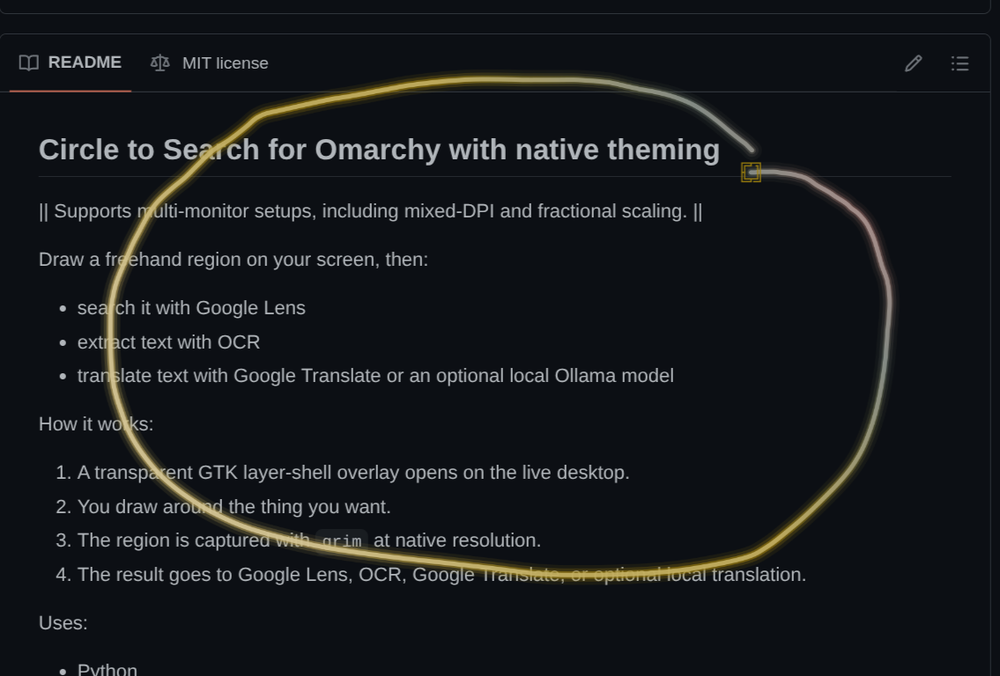
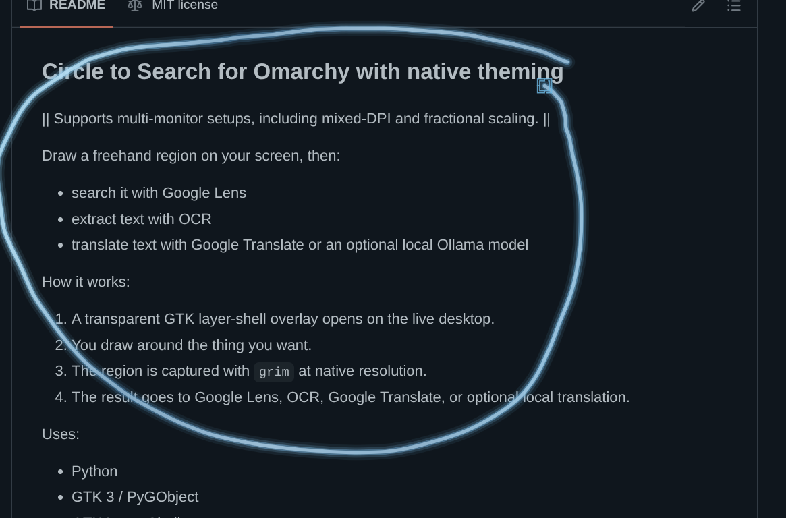

# Circle to Search

**Android-style freehand screen capture for [Omarchy](https://omarchy.org/)**

[](https://aur.archlinux.org/packages/omarchy-circle-to-search)
[](LICENSE)

Draw around anything on screen. Search it, read it, translate it.

<p>
  
  
</p>

<details>
<summary>More screenshots</summary>
<br>

<p>
  
  
</p>

<p>
  
  
</p>

<p>
  
  
</p>

<p>
  
  
</p>

</details>

---

## Features

- **Animated glow selection** — draw a freehand region with a theme-aware gradient glow
- **Google Lens search** — send your selection to Google Lens instantly
- **OCR text extraction** — pull text from any region with Tesseract
- **Translate** — Google Translate or local Ollama model, your choice
- **Multi-monitor** — supports mixed-DPI and fractional scaling
- **Native theming** — inherits your Omarchy theme automatically, including the animated selection glow

## Install

### AUR (recommended)

```bash
yay -S omarchy-circle-to-search
```

Then add keybinds to `~/.config/hypr/bindings.conf`:

```
bind = SUPER ALT, C, exec, circle-to-search
bind = SUPER ALT, T, exec, circle-to-search --translate
```

### Manual

```bash
./install.sh                # base install
./install.sh --with-ollama  # with local translation
```

The installer handles packages, keybinds, and reload.

## Usage

| Key | Action |
|-----|--------|
| Draw + release | Capture selected region |
| `Enter` | Capture full screen |
| `M` | Toggle Instant Search |
| `T` | Toggle Select & Translate |
| `Esc` | Exit |

### Translate mode

| Key | Action |
|-----|--------|
| Draw box | Add translation region |
| Scroll on region | Change font size |
| `C` | Clear all regions |
| `Z` | Undo last region |
| `Esc` | Exit translate mode |

### Dialogs

| Key | Action |
|-----|--------|
| `1` / `Enter` | Primary action |
| `2` | Secondary action |
| `3` | Third action |
| `Esc` | Cancel |

## Ollama (optional)

Local translation with no cloud dependency. Not included in the AUR package — install separately:

```bash
sudo pacman -S ollama
ollama serve
ollama pull qwen2.5:7b
```

Any Ollama model works — just pull the one you prefer and set it in the config.

Then press `T` in the menu overlay to use Select & Translate.

Configure in `~/.config/circle-to-search/config.toml`:

```toml
ollama_model = "qwen2.5:7b"       # any Ollama model
translation_target = "English"     # any language
```

## Uninstall

```bash
# AUR
sudo pacman -R omarchy-circle-to-search

# Manual
./uninstall.sh
./uninstall.sh --remove-packages  # also remove dependencies
```

## Tech

Python -- GTK 3 / PyGObject -- GTK Layer Shell -- Pillow -- grim -- Tesseract OCR

## Security / Privacy

- OCR runs locally with Tesseract
- Ollama translation runs locally over `localhost`
- Google Lens and Google Translate send data to external services
- Installer and uninstaller only touch recorded app state and packages

## Requirements

- Omarchy

Supported architectures: `x86_64`, `aarch64`

Installed by default:

- `python`
- `python-gobject`
- `python-pillow`
- `gtk3`
- `gtk-layer-shell`
- `grim`
- `wl-clipboard`
- `tesseract`
- `tesseract-data-eng`
- `python-pytesseract`

Optional:

- `ollama`


Started from the original idea and early codebase in [jaslrobinson/circle-to-search](https://github.com/jaslrobinson/circle-to-search).

This version has since been extensively rewritten with a different product focus on mind.

## License

MIT -- see [LICENSE](LICENSE)

