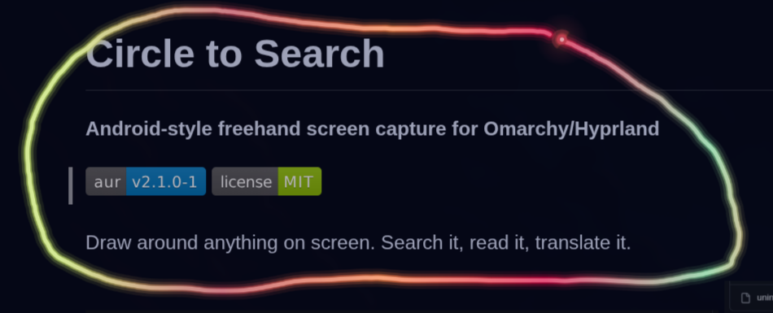
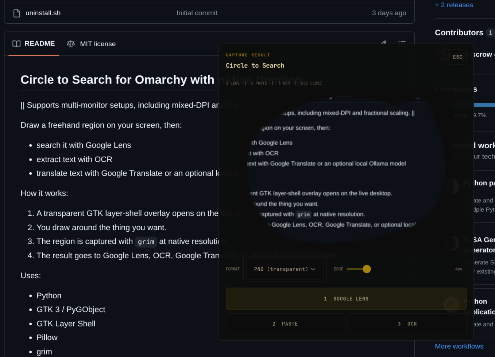
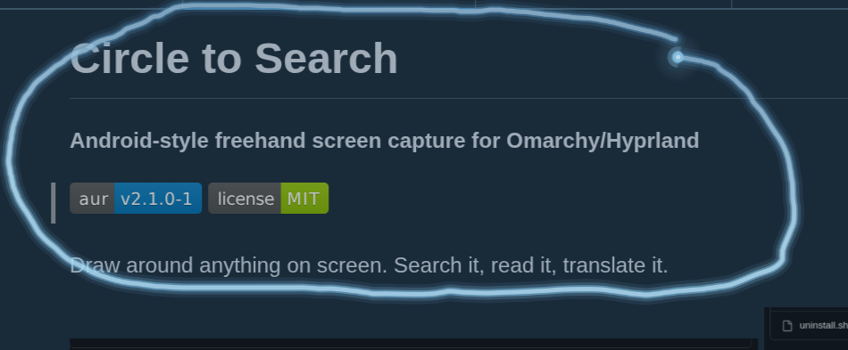
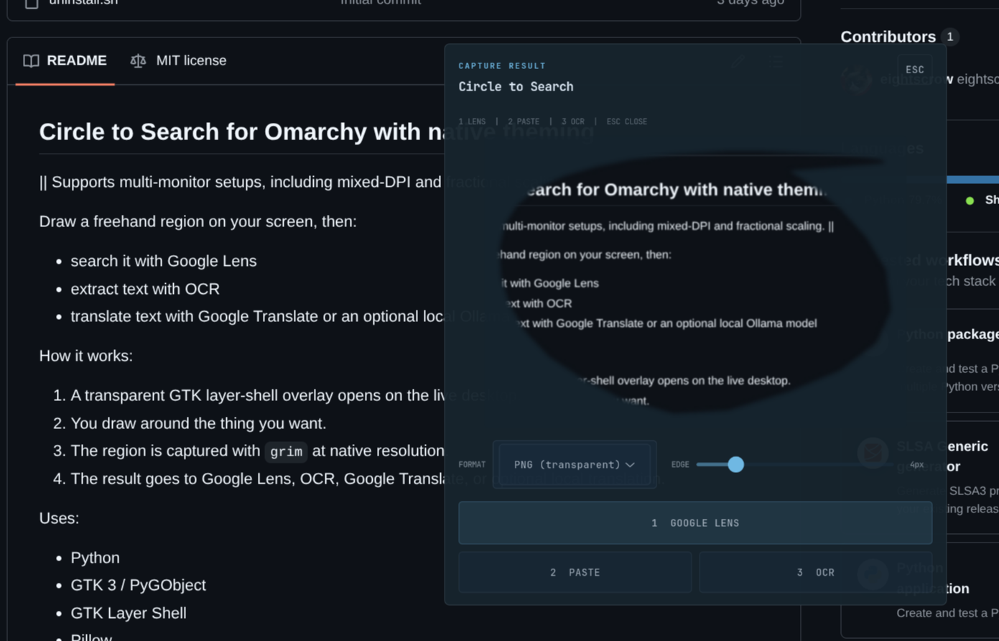
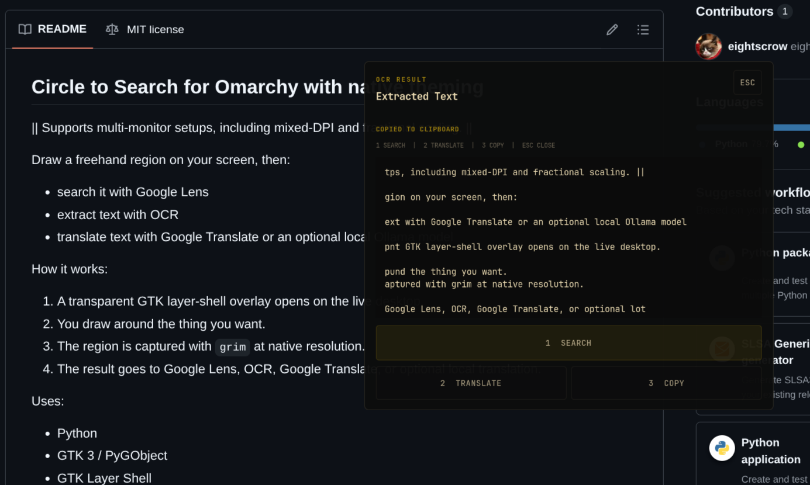
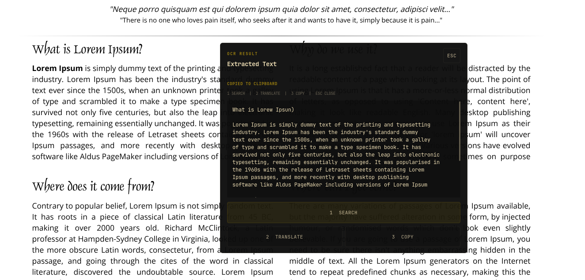
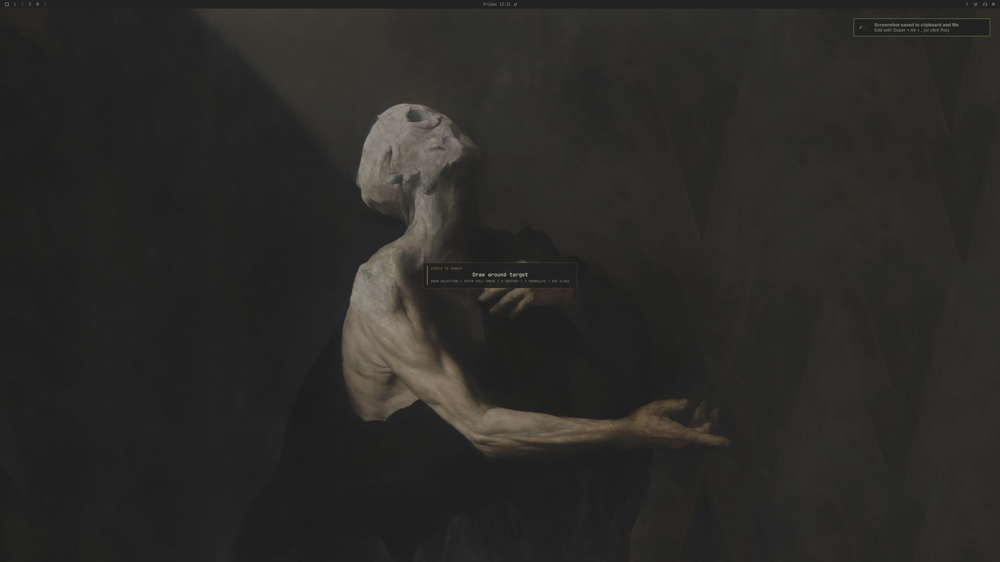
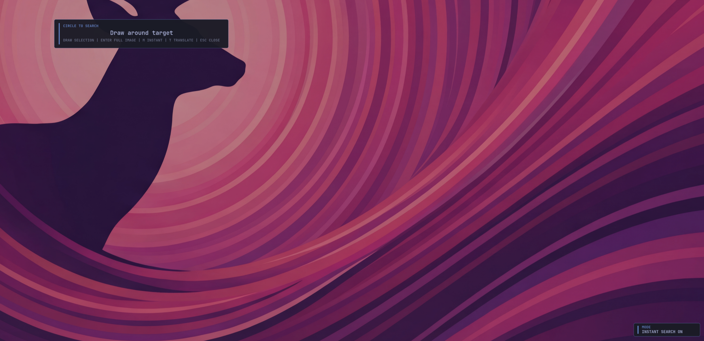
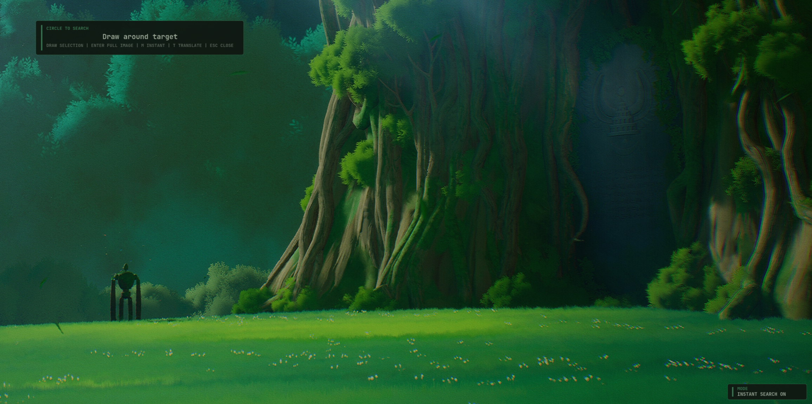
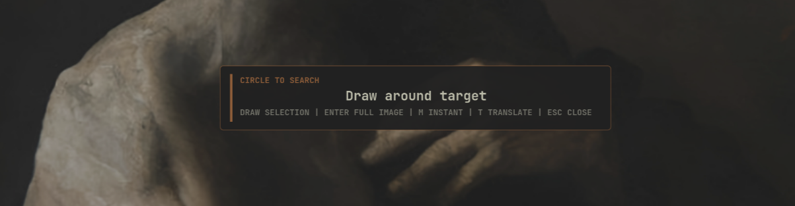

# Circle to Search

**Android-style freehand screen capture for Omarchy / Hyprland**

[](https://aur.archlinux.org/packages/omarchy-circle-to-search)
[](LICENSE)

Draw around anything on screen. Search it, read it, translate it.

<p>
  
  
</p>

<details>
<summary>More screenshots</summary>
<br>

<p>
  
  
</p>

<p>
  
  
</p>

<p>
  
  
</p>

<p>
  
  
</p>

</details>

---

## Features

- **Animated glow selection** — draw a freehand region with a theme-aware gradient glow
- **Google Lens search** — send your selection to Google Lens instantly
- **OCR text extraction** — pull text from any region with Tesseract
- **Translate** — Google Translate or local Ollama model, your choice
- **Multi-monitor** — supports mixed-DPI and fractional scaling
- **Smart theming** — auto-uses Omarchy theme if present, then Matugen/ML4W colors, with safe fallback behavior

## Install

### AUR (recommended)

```bash
yay -S omarchy-circle-to-search
```

For Omarchy / generic Hyprland setups, add keybinds to `~/.config/hypr/bindings.conf`:

```
bind = SUPER ALT, C, exec, circle-to-search
bind = SUPER ALT, T, exec, circle-to-search --translate
```

### ML4W users

Add your binds to:

`~/.config/hypr/conf/custom.conf`

Example:

```
bind = SUPER ALT, C, exec, circle-to-search
bind = SUPER ALT, T, exec, circle-to-search --translate
```

Then reload Hyprland:

```bash
hyprctl reload
```


Works on any Hyprland setup. On Omarchy, and ML4W current theme colors are used automatically.

### Manual

```bash
./install.sh                # base install
./install.sh --with-ollama  # with local translation
```

The installer handles packages, keybinds, reload, and creates a user-local launcher at
`~/.local/bin/circle-to-search`

If your session PATH does not include `~/.local/bin`, use the full launcher path in binds

## Usage

| Key | Action |
|-----|--------|
| Draw + release | Capture selected region |
| `Enter` | Capture full screen |
| `M` | Toggle Instant Search |
| `T` | Toggle Select & Translate |
| `Esc` | Exit |

### Translate mode

| Key | Action |
|-----|--------|
| Draw box | Add translation region |
| Scroll on region | Change font size |
| `C` | Clear all regions |
| `Z` | Undo last region |
| `Esc` | Exit translate mode |

### Dialogs

| Key | Action |
|-----|--------|
| `1` / `Enter` | Primary action |
| `2` | Secondary action |
| `3` | Third action |
| `Esc` | Cancel |

## Ollama (optional)

Local translation with no cloud dependency. Not included in the AUR package — install separately:

```bash
sudo pacman -S ollama
ollama serve
ollama pull qwen2.5:7b
```

Any Ollama model works — just pull the one you prefer and set it in the config.

Then press `T` in the menu overlay to use Select & Translate.

Configure in `~/.config/circle-to-search/config.toml`:

```toml
ollama_model = "qwen2.5:7b"       # any Ollama model
translation_target = "English"     # any language
```

## Theming

### Theming for non-Omarchy setups is still under development, and might not work on every system. 
I have plans to test it on some preconfigured dotfiles like Jakoolit and ML4W

Theming works out of the box for:

- Omarchy (automatic)
- ML4W / Matugen setups (automatic)

If no theme source is available, the app safely falls back to built-in defaults.

### Priority order

On launch, colors are loaded in this order (highest to lowest):

1. `~/.config/circle-to-search/colors.css` (manual overrides)
2. `~/.config/circle-to-search/theme.toml` (manual overrides)
3. Omarchy `~/.config/omarchy/current/theme/colors.toml`
4. Matugen/ML4W `~/.config/ml4w/colors/colors.json`
5. Matugen fallback `~/.local/share/ml4w-dotfiles-settings/colors/colors.json`
6. pywal fallback `~/.cache/wal/colors.json`
7. Built-in fallback palette (Tokyo Night)

User config files are created automatically on first run.

### Most users only need this

- Do nothing if you use Omarchy or ML4W/Matugen and like automatic theming.
- Edit `~/.config/circle-to-search/colors.css` for quick manual color tweaks.
- Edit `~/.config/circle-to-search/theme.toml` if you prefer TOML over CSS.

### Omarchy (automatic)

Nothing to do. If Omarchy is installed and a theme is active, Circle to Search picks up
`~/.config/omarchy/current/theme/colors.toml` automatically. Switching Omarchy themes
updates the overlay on next launch.

This is the default path for Omarchy users.

### Manual color override

Edit `~/.config/circle-to-search/colors.css` — only set the values you want to change.
Unset keys continue to come from Omarchy, Matugen/ML4W, or pywal fallback.

```css
:root {
  --cts-accent: #ff6e6e;
  --cts-background: #1a1b26;
  --cts-foreground: #a9b1d6;
}
```

All available CSS variables follow the `--cts-<key>` pattern, where `<key>` matches
the color role names in the table above (e.g. `--cts-accent-alt`, `--cts-surface`).

Alternatively, edit `~/.config/circle-to-search/theme.toml` — TOML format, same keys:

```toml
accent = "#ff6e6e"
background = "#1a1b26"
```

`colors.css` and `theme.toml` both override Omarchy, Matugen, and pywal fallback. Changes are picked up on
the next Circle to Search launch.

### Common color keys

| Key | What it affects |
|-----|-----------------|
| `background` | Overlay and dialog background |
| `foreground` | Main text color |
| `accent` | Selection glow and key highlights |
| `accent_alt` | Secondary highlights |
| `surface` | Card and panel backgrounds |
| `font_ui` | Dialog font family |

Advanced keys are also supported: `muted`, `success`, `warning`, `danger`, `interactive`, `interactive_hover`, `highlight`.

### GTK widget style

For advanced GTK overrides (fonts, button sizes, dialog borders), edit:

`~/.config/circle-to-search/custom.css`

This is standard GTK 3 CSS applied on top of the built-in stylesheet. Leave empty to use defaults.

### pywal (optional fallback)

Run pywal normally:

```bash
wal -i /path/to/wallpaper
```

If Omarchy and Matugen/ML4W sources are not available, Circle to Search can read pywal's
default JSON export at `~/.cache/wal/colors.json`.

If you use a non-default pywal cache location, use `theme.toml` or `colors.css`
instead, because Circle to Search currently reads only that default pywal path.

### matugen / ML4W (recommended on non-Omarchy setups)

Circle to Search reads Matugen/ML4W generated colors directly from:

- `~/.config/ml4w/colors/colors.json`
- `~/.local/share/ml4w-dotfiles-settings/colors/colors.json` (fallback path)

No separate Circle to Search template is required.

If you run Matugen manually and want a non-interactive command suitable for scripts:

```bash
matugen image /path/to/wallpaper --source-color-index 0 --mode dark --quiet
```

On next launch, Circle to Search uses the updated palette automatically.

### Safety behavior

If a theme source provides invalid or missing color values, Circle to Search logs a warning,
falls back per-color to safe defaults, and continues running. Theme issues should not crash
the app.

## Uninstall

```bash
# AUR
sudo pacman -R omarchy-circle-to-search

# Manual
./uninstall.sh
./uninstall.sh --remove-packages  # also remove dependencies
```

## Tech

Python -- GTK 3 / PyGObject -- GTK Layer Shell -- Pillow -- grim -- Tesseract OCR

## Security / Privacy

- OCR runs locally with Tesseract
- Ollama translation runs locally over `localhost`
- Google Lens and Google Translate send data to external services
- Installer and uninstaller only touch recorded app state and packages

## Requirements

- Hyprland

Supported architectures: `x86_64`, `aarch64`

Installed by default:

- `python`
- `python-cairo`
- `python-gobject`
- `python-pillow`
- `gtk3`
- `gtk-layer-shell`
- `grim`
- `wl-clipboard`
- `tesseract`
- `tesseract-data-eng`
- `python-pytesseract`

Optional:

- `ollama`


Started from the original idea and early codebase in [jaslrobinson/circle-to-search](https://github.com/jaslrobinson/circle-to-search).

This version has since been extensively rewritten with a different product focus on mind.

## License

MIT -- see [LICENSE](LICENSE)

